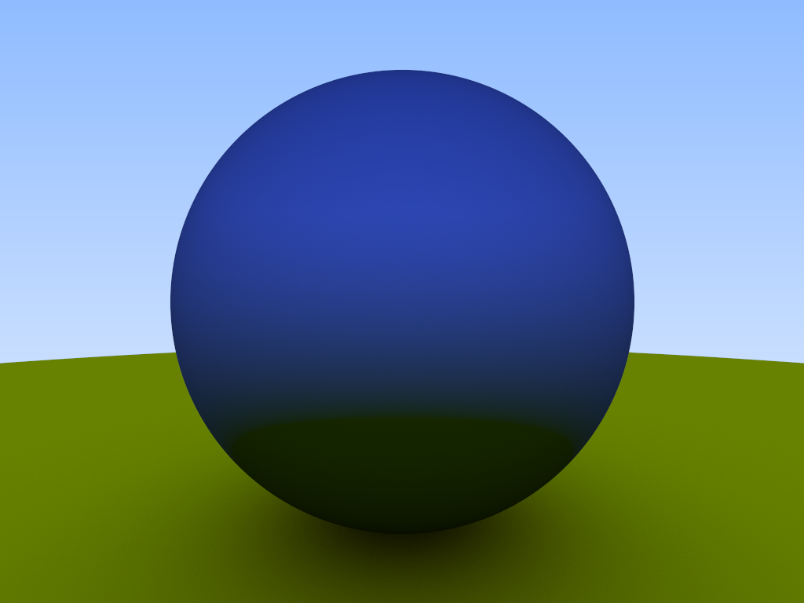

# Ray tracer
A simple ray trace program running on the GPU using [Metal](https://developer.apple.com/metal/) and Rust.
This project is based on [post](https://raytracing.github.io/books/RayTracingInOneWeekend.html#rays,asimplecamera,andbackground/therayclass) by Peter Shirley, Trevor David Black and Steve Hollasch.

# Example image:

